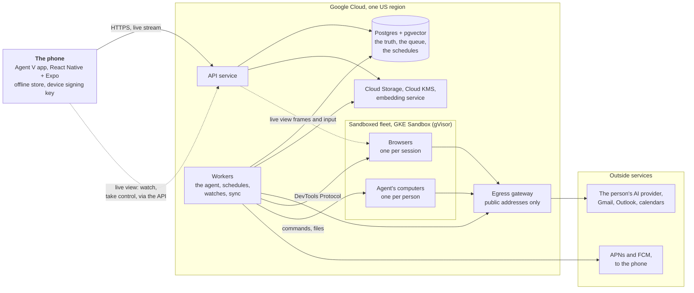

# Stage 6 — Technical design

**Status:** part 1 in draft on 2026-09-25: the provider facts it relies on are being checked before it is proposed. Part 2 follows once part 1 is agreed.
**Builds on:** stages [1](01-foundations.md) to [5](05-design-system.md), and the
[rules for building Agent V](README.md#rules-for-building-agent-v).

Stage 6 decides how Agent V is built. It comes in two parts, reviewed one at a time (D81):

| Part | What it covers |
|---|---|
| **1. The system** (this proposal) | The parts and how they fit: the app, the server, how a job runs, signatures, AI providers, connected accounts, the cloud browser, the agent's computer, memory, live updates, files, the data model, and answers to the questions earlier stages left for stage 6 |
| **2. Running it safely** | Security and privacy in depth (threats, encryption, prompt injection), the data flows for the stores' privacy forms, export and deletion, fair-use limits and running costs, monitoring and support, backups, how everything is tested and verified end to end, releases |

### The owner's choices for this stage

Asked on 2026-09-25 and recorded as decisions below:

| Choice | Decision |
|---|---|
| How the phone apps are built | React Native with Expo, one TypeScript codebase for iPhone and Android (D82) |
| The server's language | TypeScript on Node, sharing its types with the app (D83) |
| Where it runs | Google Cloud, one US region at launch, with room for an EU region later (D84) |
| The cloud browser and the agent's computer | Built by us and run on our own Google Cloud infrastructure: no browser or sandbox provider (D85). The owner first chose providers, then on the same day set the rule: everything custom |
| Speech to text | On the phone (D86) |
| Memory search | Our own small open embedding model, the same for everyone (D87) |
| Everything custom | No AI agent SDKs and no vendor client libraries; we don't buy what we can build. Only what no one's code can replace (the person's AI provider, their Gmail and Outlook, Apple and Google sign-in and push) is called, by our own small clients (D88, and [rule 6](README.md#rules-for-building-agent-v)) |

---

## 1. The system at a glance

| Part | What it does | Built with |
|---|---|---|
| **The app** | Everything you see: handing off, Today, Needs you and signing, jobs, the live browser, settings. Keeps the last known state for offline reading | React Native + Expo, TypeScript (section 2) |
| **API service** | The app's only door: sign-in, reading and changing your data, signatures, the live update stream. Stateless; scales with traffic | Node + TypeScript on Cloud Run (section 3) |
| **Workers** | Everything that happens without you: running jobs, repeating runs, watches, ideas, email and calendar sync, reminders and the 24-hour limits | The same codebase, a different entry point (sections 3 and 4) |
| **Postgres** | The one source of truth: accounts, jobs, plans, the record, Needs you, memory, and also the work queue and schedules | Cloud SQL for PostgreSQL with pgvector (sections 3 and 12) |
| **Files** | Attachments, results, the files the agent makes, exports | Cloud Storage, private buckets (section 11) |
| **Cloud KMS** | Keeps the keys that encrypt people's AI keys, account tokens and saved logins | Envelope encryption (section 5) |
| **Egress gateway** | All calls to the internet leave through it: a fixed address, and a check that the destination is a public address, never our own network | Section 5 |
| **Embedding service** | Turns text into vectors for memory search, on our own servers | A small open model on CPU (section 9) |
| **Sandboxed fleet** | The cloud browsers (one per session) and the agent's computers (one per person), each in its own gVisor sandbox, with no route into our own network | Our own code on GKE Sandbox (sections 7 and 8) |
| **Outside services** | Only what no one's code can replace: the person's AI provider, their email and calendar, push delivery through Apple and Google | Our own small clients over HTTPS and standard protocols (D88) |

Two principles run through every section:

- **The server decides; the model proposes.** The AI model plans and chooses tools, but what it
  may do, when it must ask, and what counts as signed are enforced by our code (section 4).
- **Postgres is the truth.** Every change to a job is written there before anything else
  happens, so a crash, a restart or a deploy never loses work or repeats an action (D89, D90).

## 2. The app

### Stack

- **React Native with Expo** (D82), in TypeScript, with Expo's native build and store services.
  Only general-purpose libraries; no UI kit. The components are our own, built to the
  24-component specification of stage 5 (D79).
- **One shared package** of types and checks with the server (D83): every request and response,
  every job state and every Needs you item is defined once. A change that would break the app
  fails to build rather than failing on someone's phone.
- **Design tokens** come from the same source as the design system (D71):
  `docs/design/prototype/tokens.py` generates a typed theme file for the app, and the build
  checks it is current, the same way `doc_tables.py` checks stage 5's tables (D95).

### What the app keeps on the phone (answers the stage 4 question)

| What | Where | How long |
|---|---|---|
| The last known state of Today, Needs you, Jobs, Goals, Ideas and settings | SQLite, in the app's private storage, protected by the phone's own file encryption | Until replaced by a newer state |
| Job pages you've opened, with their record and results | The same | 30 days after you last opened them, or until the job is deleted |
| Files you've opened | The app's cache | 7 days, or sooner if the phone needs space |
| Drafts you typed but didn't hand off (D66) | SQLite | Until sent or cleared |
| Hand-offs typed while offline (D58) | SQLite, as a queue you can see and cancel | Until sent |
| Sign-in (a refresh token) | Keychain (iPhone) and Keystore (Android), via Expo's secure store | Until sign-out |
| The device signing key (section 4) | Secure Enclave or StrongBox/TEE, never leaves the chip | Until sign-out or a new phone |

Signing out, or deleting the account, erases all of it (D94). Nothing that can act is ever queued
offline: signatures, answers, taking control and settings need a connection (D58).

### Native pieces

| Need | How |
|---|---|
| Notifications with Sign and send, and answers, as actions (J4) | Expo notifications with notification categories and actions |
| Face ID, Touch ID, fingerprint or PIN for Spend and Can't undo | Expo local authentication, and a small native module of our own for the device signing key (section 4) |
| Speech to text (D86) | The phone's own speech recognition, on-device where the phone supports it, through a small native module; audio never leaves the phone |
| Sharing into Agent V from other apps (D21) | An iOS share extension and an Android share target |
| Haptics on signing | A light tap when a hold starts, a firm success when it completes, and an error pattern if it's cancelled; the same on both platforms through Expo haptics (answers stage 5) |
| The live browser (J5) | Our own view that draws the browser's frames as they stream in; in control, your taps, scrolls and typing go back to the cloud browser (section 7) |
| Sign in with Apple and Google (D44) | The platforms' own sign-in; the app sends the identity token to the API, which verifies it (section 3) |

Widgets, Live Activities and assistant shortcuts stay out of launch (D22).

## 3. The server

### One codebase, two kinds of process

The server is one TypeScript codebase (D83) that starts as either:

- **the API service**: answers the app, holds the live update streams, verifies signatures; it
  never runs the agent itself; and
- **a worker**: takes work from the queue in Postgres and does it: running jobs, repeating runs,
  watches, ideas, email and calendar sync, reminders, the 24-hour limits, exports and deletions.

Both run on **Cloud Run** in one US region (D84). The API is a Cloud Run service and scales with
traffic. Workers are a Cloud Run **worker pool**, made for background work that answers no
requests; our own code scales it with the length of the queue. The browsers and the agent's
computers run in a separate sandboxed fleet (sections 7 and 8).

### Postgres is the truth, and the queue (D89)

- **Cloud SQL for PostgreSQL**, with high availability across two zones, automatic backups and
  point-in-time recovery (the numbers are set in part 2).
- **The work queue and every schedule live in Postgres**, not in a separate queue service. A
  worker takes an item with `SELECT … FOR UPDATE SKIP LOCKED`, holds a lease while it works and
  renews it; if a worker dies, the lease runs out and another worker carries on. One store means
  the queue can never disagree with the data: a job and the work to continue it are written in
  the same transaction.
- A general-purpose Postgres job-queue library is used for the lease and retry mechanics (the
  choice is confirmed in part 2 after a code review of the candidates); the agent's own logic is
  ours (D88).
- Times: repeating jobs, watches, reminders and the 24-hour limits are rows with a "next due"
  time; workers pick up whatever is due. There is no separate scheduler to keep in step.

### Sign-in (D44)

- **Apple and Google:** the app signs in with the platform, and sends the identity token; the API
  verifies its signature, audience and expiry against Apple's and Google's published keys.
- **Email code:** a six-digit code, valid for 10 minutes, five tries. How the email is sent under
  rule 6 is an open question for the owner (below).
- **Sessions:** a short-lived access token (15 minutes) and a refresh token that rotates on every
  use and is stored only in the phone's secure store. A reused refresh token signs that device out
  (it means the token was copied). Each phone is listed in settings and can be signed out.
- No passwords are ever stored (D44). There is no sign-in vendor: the pieces are small, standard
  and fully under our control (D96).

## 4. Jobs: how the agent runs

The agent is our own code (D88). Its shape follows the job model agreed in stage 1.

### A job, as data

| Piece | What it is |
|---|---|
| **Job** | Title, what "done" means, its stage (Planning, Working, Needs you, Scheduled, Done, Couldn't finish, Stopped), its repeat rule if any, the goal it belongs to |
| **Plan** | Ordered steps. Each step has what it does, whose it is (the agent's or yours) and the **highest action level** it can reach (Look, Prepare, Act as you, Spend, Can't undo) |
| **Record** | Every event, in order and never edited: each model turn, each tool call with its inputs and outputs, each signature, each follow-up, with times and the AI usage of each turn. The job page, replay (D41) and "what it tried" (D61) are all read from here |
| **Needs you items** | Signatures, questions, take control and problems that stop work (D59), each tied to one step |
| **Follow-ups** | Messages you added while it works, queued in order (D42) |

### The run loop

A worker runs a job as a loop:

1. **Build the context**: the job, the plan, a short summary of the record so far (the full record
   stays in Postgres), the follow-ups that are due, and what memory finds relevant (section 9).
2. **Call the model** with the tools this job may use, through our own client for the person's
   provider (section 5), streaming the answer.
3. **Write the model's turn to the record** before acting on it.
4. **For each tool call:** check its action level against the person's rules (below). If it may go
   ahead, write "about to run" to the record, run it, and write the result. If it needs you,
   create the Needs you item and stop this branch of the work.
5. **Checkpoint** and repeat, until the job is done, can't finish, or has to wait.

When a job has to wait (for a signature, an answer, a person in control, a schedule or a watch),
the worker **lets it go**: the job is stored with what it's waiting for, and whichever worker is
free picks it up when the wait is over. Nothing sits in memory for hours, so deploys and restarts
are safe.

### Nothing happens twice (D90)

- Every tool call that changes something outside Agent V (sends an email, creates an event,
  submits a form) gets an **idempotency key** written to the record before it runs.
- If a worker stops between "about to run" and the result, the next worker checks the outside
  service before trying again. An email is first saved as a draft, and the draft's id is
  recorded; it is then sent from the draft. On a retry, a draft that no longer exists was sent, and
  the sent message is found by its thread (Gmail), or by the `internetMessageId` set on the draft
  (Outlook, through Microsoft Graph). A Google Calendar event is created with an id made from the key, so a
  second create is refused; an Outlook event carries the key as its `transactionId`, which Graph
  uses to refuse duplicates. If it happened, the result is recorded; if it didn't, it's run once.
- Where an outside service offers no way to check (some websites), the step is **not** repeated
  blindly: it becomes a Needs you item asking you to check, in plain words.
- Short failures (a network error, a slow site) are retried up to 3 times with growing waits;
  after that the job can't finish and says why (D50).

### Action levels are enforced by code (D91)

- **Every tool declares its level.** Reading an email is Look; writing a draft is Prepare; sending
  is Act as you. The model can't change a tool's level.
- **Browser actions are classified per action.** Reading and moving around are Look. Typing into
  a form is Prepare. Pressing a button or link that submits, buys, books, posts, deletes or
  unsubscribes is at least Act as you. The model must say what a press will do, and our code
  raises the level when the page shows signs of more: payment fields, prices in a checkout, words
  like "Pay", "Buy", "Delete", "Cancel subscription". When our code is unsure, it takes the higher
  level. Part 2 details this, with the rest of the defence against instructions hidden in web
  pages and emails.
- **The hard limits** (stage 1, section 6) are checked in the same place: it never changes
  passwords or security settings, never gives data to anyone not approved, and never acts inside
  anyone else's account.
- **Learning to ask less** (D8) is a rule stored per person ("send replies to scheduling emails
  without asking"), matched by code against the exact kind of action. It never applies to Spend
  or Can't undo.
- **When the plan is shown first** (D2) is decided by code from the plan: any step at Act as you
  or above, an estimate over 30 minutes, or more than 8 steps.

### Signatures (D92)

A signature must be about the exact, current content (D63), and Spend and Can't undo need Face ID
or a fingerprint (D7). So:

1. When a step needs you, the server stores **exactly what will happen**: the full email with its
   recipients, the exact amount, what will be deleted. It computes a **fingerprint** of that
   content (SHA-256) and gives the item a version number.
2. The app shows that content in full (D62) and, when you finish holding, sends the fingerprint
   and the version back.
3. For **Spend and Can't undo**, the phone also **signs the fingerprint with a key that never
   leaves the phone's secure chip**, and that the chip releases only after Face ID, Touch ID or
   the fingerprint or PIN. The server checks the signature with the public half, registered when
   the phone signed in.
4. The server runs the step only if the fingerprint and version still match what it stored. If
   anything changed, even one word or one cent, the page shows the new version and the hold
   starts again (D63).
5. The signature, the fingerprint, the device and the time are written to the record.

A notification's **Sign and send** (J4, Act as you only) carries the fingerprint and version in
the notification. It works only on an unlocked phone and goes through the same check. Offline,
nothing is signed or queued (D58).

### Repeating jobs, watches and ideas

- A **repeating job** is a job with a repeat rule; each run is a child run with its own record,
  filed under the job (D3).
- A **watch** checks on its schedule, stores each value, and notifies once per change (J6). After
  several failed checks in a row it waits longer between checks, and tells you once. The page
  (D67) reads its stored values.
- **Ideas** (D36) come from a quiet run over your own connected data and goals, at most once a
  day, using your AI key, with a cap on its cost. Each idea stores its evidence and sources. What
  you set aside is remembered, so it suggests fewer like it.

## 5. AI providers: your own key

### Our own clients (D88)

Four wire formats cover every provider in stage 1, section 8:

| Format | Used for |
|---|---|
| OpenAI Responses | OpenAI |
| Anthropic Messages | Anthropic |
| Gemini generate content | Google |
| OpenAI Chat Completions | Any OpenAI-compatible endpoint: OpenRouter, Groq, Together, Mistral, DeepSeek, xAI, and self-hosted models |

Each client is small and ours: it builds the request, parses the streamed answer (server-sent
events) into one common shape of text, tool calls and usage, and turns each provider's errors
into our own few kinds (key declined, out of credit, rate-limited, model gone, provider down).
Those kinds drive the Needs you items of J9.
Each client also keeps its provider's rules for a conversation with tools: for example, Gemini's
thought signatures are sent back with every function call, and OpenAI's Responses API is called
with storage turned off, so the conversation lives only in our record. Each client is tested against the real provider with
a real key (part 2); nothing in the shipped app imitates a provider (rule 1).

### Keys

- **Checked when added** with a real, small test call; the model list is read from the provider
  where it offers one. Models that can't use tools are marked and can't be picked for jobs.
- **Stored encrypted** with envelope encryption: each key is encrypted with a data key, and the
  data key is encrypted by Cloud KMS. The plain key exists only in a worker's memory while a call
  is made. It is never logged, never shown again and never sent to the phone (stage 1).
- **Replaced or removed** at any time; removing it deletes the encrypted copy at once.

### Custom endpoints are public addresses only

A custom endpoint may only reach the public internet. Every outside call leaves through the
**egress gateway**, which resolves the name, rejects private, loopback, link-local and cloud
metadata addresses, connects only to the address it checked (so a name can't change between the
check and the call), and follows no redirects to other hosts. This protects Agent V's own
network (stage 1, section 8).

### Usage and cost

- Each model turn's usage (input, output and cached tokens) is written to the record, so a job
  shows what it used (stage 1, "cost visibility").
- The estimated cost uses a price table we keep per model; where a price is unknown, the job
  shows usage without a cost.
- The monthly limit is checked before each model call. When the month's estimate reaches it,
  jobs pause with one Needs you item (D52).

## 6. Connected accounts: email and calendar

| Account | How it connects | How changes arrive |
|---|---|---|
| Gmail and Google Calendar | Google sign-in with the smallest scopes each ability needs; Gmail's read and send scopes are restricted and need Google's security assessment (D11) | Gmail push notifications through Cloud Pub/Sub, then a read of what changed; calendar change notifications |
| Outlook mail and calendar | Microsoft sign-in, Microsoft Graph | Graph change notifications, renewed before they expire |

- Tokens are encrypted like AI keys (section 5), refreshed by workers, and erased at once on
  disconnect or account deletion.
- When a token stops working, the jobs that need that account pause, and one Needs you item says
  "Gmail needs you to sign in again" (J9).
- Email and events are read when a job needs them. What's kept is what a job used, stored with
  that job, plus the small index needed to find things again. A full copy of your inbox is never
  kept.

## 7. The cloud browser

Our own browsers, on our own infrastructure (D85, rule 6).

- **Where it runs:** each browser session is a Chromium in its own container, in a **GKE
  Sandbox** node pool on Google Kubernetes Engine. GKE Sandbox runs every container inside
  **gVisor**, Google's own sandbox (the one Cloud Run uses), so a hostile page that breaks out of
  Chromium still meets a second wall. One session per container, never shared, deleted when the
  session ends. Our own small fleet controller (part of the worker code) starts and stops these
  containers through the Kubernetes API, keeps a few warm ones ready so a session starts in about
  a second, and removes anything left over.
- **Its network:** browsers reach only the public internet, through the egress gateway (section
  5); they can't reach Agent V's own services, the cloud's metadata server or each other.
- **Driving it:** a worker connects to its browser over the **Chrome DevTools Protocol** with
  Playwright (rule 6). The agent sees each page as its text and structure plus a screenshot, and
  acts by clicking, typing and scrolling, each action classified (section 4).
- **The live view (J5):** our own. The browser sends the page as a stream of frames over the
  DevTools Protocol (screencast); the API, as a second DevTools client of the same browser, relays them to the app over a web socket, and the app
  draws them, with where the agent is pointing. Frames are shown, never stored.
- **Taking control (D49, D60):** the job pauses; your taps, scrolls and typing go back over the same
  socket and are sent to the browser as DevTools input events. While you're in control, the agent
  neither acts nor records screenshots or keystrokes. "Done, carry on" hands back; after 10 idle
  minutes it hands back by itself, and the job waits in Needs you.
- **Saved logins (D38):** each person has their own browser profile (cookies and site storage). At
  the end of a session it is packed, encrypted with that person's own data key (envelope
  encryption, section 5) and kept in Cloud Storage; the next session unpacks it. Signing in once
  through Take control keeps the site signed in. Each saved site is listed in settings; removing
  one deletes its cookies from the profile. Passwords and codes are only ever typed by you.
- **Sites that block automation:** there is no CAPTCHA-solving service. A CAPTCHA, login or code is
  a moment to take control (D49), and a site that keeps blocking is reported honestly (stage 1,
  section 13).
- **Sessions are closed** as soon as a step no longer needs them, and are capped in length (part 2),
  since browser time is Agent V's own cost.

## 8. The agent's computer

A private computer per person, ours as well (D85, rule 6).

- **Where it runs:** a container of its own in the same GKE Sandbox fleet, inside gVisor, from our
  own Linux image with the tools data work needs (Python with its data libraries, a spreadsheet
  engine, command-line tools). Never shared.
- **Isolation:** no route into Agent V's own network or to other computers; it reaches the public
  internet only through the egress gateway, under rules we set (part 2).
- **Your files persist:** each person's workspace is their own persistent disk. When the computer
  is idle it stops, and the disk stays; the next command starts it again with the files in place,
  in seconds. What was running in memory doesn't survive a stop, so long commands keep it awake
  until they finish. The workspace counts toward the storage allowance (J8).
- **Our own small agent inside:** a tiny program of ours in the image runs commands, streams their
  output, and reads and writes files, over one authenticated connection from the workers. It is
  the only way in.
- **Every command is recorded:** the command, its output (trimmed for very long output, with the
  full output kept as a file) and its exit code go into the job's record, so Jobs → Computer shows
  every command it ran (D39).
- **No keys inside:** the computer never holds your AI key or account tokens. The agent runs on
  the workers and only sends commands in.

## 9. Memory

- **What's stored:** short facts and preferences it learned ("prefers morning meetings", "Maya is
  the design lead"), each with where it came from and when. You can see, search and forget any of
  them (stage 1).
- **How it's found:** each memory is turned into a vector by our own embedding service (D87),
  which runs a small open multilingual model with a permissive licence on CPU, through a
  general-purpose inference library. The candidates are IBM's Granite multilingual embedding
  model (311M parameters, Apache-2.0) and Qwen3-Embedding-0.6B (Apache-2.0); the choice is made by
  measuring both on real retrieval tests during the build, and recorded then. The vectors
  are stored in Postgres with pgvector. When a job starts or a step needs context, the closest
  memories are found by vector search combined with plain word search, and the best few go into
  the context.
- **Why our own model:** memory works whichever AI provider you use, keeps working when you
  switch, and the text never leaves our servers for this.
- **Forgetting** deletes the memory and its vector at once (with Undo for 5 seconds, D65).

## 10. Live updates and notifications

- **In the app:** while it's open, the app holds one live stream from the API (server-sent events)
  and receives every change to what it shows: a job's stage, a new record line, a Needs you item.
  Changes are also stored offline (section 2). A stream lasts at most 60 minutes on Cloud
  Run, and can drop at any time; the app reconnects, and asks for everything since the last change
  it saw, so nothing is missed (D93).
- **Outside the app:** push notifications through APNs (iPhone) and FCM (Android): a signature
  waiting, a question, a result, a watch alert, a problem that stops work. The text of a
  signature notification is the exact content, so it can be signed there (J4).
- **Quiet by design:** one notification per change, idea notifications only if you turn them on,
  at most one a day (J7); reminders once, at the 24-hour limit (D64).

## 11. Files and documents

- Files live in **Cloud Storage**, in private buckets, each under its person's own folder, never
  public. The app gets short-lived signed links to open or share a file.
- **Reading documents:** text is taken from PDFs by our own code; photos of paper and scanned PDFs
  are read by the person's AI model when it can read images (a model that can't is told so in
  plain words).
- **Filling PDF forms** and making files happens on the agent's computer or in the worker, with a
  general-purpose PDF library.
- **Statements** for the spending summary (D40) are files like any other, read on the agent's
  computer; no bank connection.

## 12. The data model

The main tables, all in Postgres. Every table that holds personal data has the person's id, so
export and deletion (part 2) are complete by construction.

| Table | Holds |
|---|---|
| `people` | Name, photo, writing tone (D43), appearance, time zone, notification choices |
| `devices` | Each signed-in phone, its push token and its public signing key |
| `sessions` | Refresh tokens, stored as hashes, with rotation history |
| `ai_keys` | Provider, base URL, encrypted key, model list, chosen models, monthly limit |
| `accounts` | Connected Gmail, Outlook and calendars: scopes and encrypted tokens |
| `jobs` | Job, stage, repeat rule, goal, what done means |
| `plans`, `steps` | The plan and its steps, with each step's action level |
| `record` | The append-only record of each run: model turns, tool calls, results, signatures, usage |
| `needs_you` | Items waiting on you: kind, content, fingerprint, version, deadline |
| `follow_ups` | Queued messages per job (D42) |
| `rules` | "Ask less" rules (D8) |
| `watches`, `watch_values` | Watches and each value they saw |
| `goals`, `milestones`, `ideas` | Goals, their milestones, ideas with evidence |
| `memories` | Memory text, its vector, where it came from |
| `files` | File metadata; the file itself is in Cloud Storage |
| `saved_logins` | The sites in your browser profile; the profile itself is encrypted in Cloud Storage |
| `browser_sessions` | Each browser session: its job, its container, when it started and ended |
| `computers` | Your sandbox computer's id, state and storage used |
| `queue` | Work waiting for a worker, with leases |
| `support_refs` | Support references (section 13) |

## 13. Answers to questions left for stage 6

| Question (from) | Answer |
|---|---|
| The app framework, and how tokens reach it (stage 5) | React Native with Expo (D82); `tokens.py` generates a typed theme file for the app, and the build checks it is current (D95) |
| Haptics on signing and the hold completing (stage 5) | A light tap as a hold starts, a firm success when it completes, an error pattern if cancelled (section 2) |
| How voice becomes text (stages 1 and 3) | On the phone, on-device where supported; audio never leaves the phone (D86) |
| Memory search needs an embedding model (stage 1) | Our own small open model on our servers, the same for everyone (D87, section 9) |
| How much is stored on the phone for offline reading, and for how long (stage 4) | Section 2: the last known state, job pages opened in the last 30 days, files opened in the last 7 days; erased on sign-out (D94) |
| How support references map to server logs without holding personal data (stage 4) | Each error shown with a reference gets a random short code (like `K7Q-4M2`), stored with the request's trace id, the time and the error kind, never the content. Logs carry ids, never personal content, so the reference leads to the logs without exposing anything (D98; logging rules in part 2) |
| Timeouts and limits: browser time, computer time and storage, jobs at once (stages 1, 2 and 3) | Part 2, with the running costs |

---

## Decisions in this stage (part 1)

| ID | Decision | Why |
|---|---|---|
| D81 | Stage 6 comes in two parts: the system, then running it safely | Each is reviewed properly; neither is rushed |
| D82 | The phone apps are React Native with Expo, one TypeScript codebase; our own components to the stage 5 specification | The owner's choice: one codebase for both phones, shared types with the server, native modules where needed |
| D83 | The server is TypeScript on Node, one codebase with two entry points (API and worker), sharing one package of types with the app | The owner's choice: one language end to end, so a breaking change fails the build, not a phone |
| D84 | Google Cloud, one US region at launch: Cloud Run (a service for the API, a worker pool for workers), GKE Sandbox for the browsers and computers, Cloud SQL for PostgreSQL, Cloud Storage, Cloud KMS, Pub/Sub for Gmail push | The owner's choice: the least infrastructure to run reliably, room for an EU region later |
| D85 | The cloud browsers and the agent's computers are our own: Chromium and our own Linux image in containers on GKE Sandbox (gVisor), started by our own fleet controller; our own live view and Take control over the DevTools Protocol; saved logins as encrypted profiles in Cloud Storage; persistent disks for the computers | The owner's rule: everything custom. The owner first chose providers, then replaced that the same day. gVisor gives a second wall around every browser and computer without running our own virtual machines |
| D86 | Speech becomes text on the phone | The owner's choice: free, fast, private, works with every provider |
| D87 | Memory uses our own small open embedding model on our servers | The owner's choice: works with every provider and survives switching |
| D88 | Everything custom: no AI agent SDKs or vendor client libraries; the agent loop and every client are our own code over plain HTTPS and standard protocols; only what no one's code can replace is used from outside (the person's AI provider, Gmail and Outlook, Apple and Google sign-in and push) | The owner's rule 6: full control and understanding of every part |
| D89 | Postgres is the one source of truth, and also holds the work queue and every schedule | One store can't disagree with itself; no separate queue or scheduler to keep in step |
| D90 | Every change is recorded before and after it happens; outside actions carry an idempotency key and are checked before any retry; where they can't be checked, you're asked | A crash or deploy never loses work or sends anything twice |
| D91 | Action levels, hard limits and "ask less" rules are enforced by our code, per tool and per browser action; when unsure, the higher level | The model proposes; the server decides |
| D92 | A signature is a fingerprint of the exact content and its version; Spend and Can't undo are also signed by a key in the phone's secure chip, released only by Face ID or fingerprint | A signature provably covers exactly what you saw, and a stolen session can't spend |
| D93 | One live stream per open app, catching up on reconnect; push notifications when the app is closed | Live without polling; nothing missed |
| D94 | The phone keeps the last known state, job pages opened in 30 days and files opened in 7; all erased on sign-out | Fast, useful offline, and bounded |
| D95 | The app's theme is generated from `tokens.py` and checked in the build | One source for design and app (D71) |
| D96 | Sign-in is our own: Apple and Google identity tokens verified by the API, email codes, rotating refresh tokens; no passwords, no sign-in vendor | Small, standard and fully ours |
| D97 | Workers let a waiting job go; any worker resumes it when the wait is over | Long waits cost nothing, and restarts are safe |
| D98 | Support references are random short codes tied to trace ids; logs never hold personal content | Support can find a problem without seeing your data |

## Open questions for part 2

| Question |
|---|
| How the agent searches the web, and how sign-in codes are emailed, under rule 6 (asked of the owner with part 1) |
| Every outside service that remains, with its data handling |
| Fair-use limits (browser time, computer time and storage, jobs at once, watches) and the running cost per person |
| The defence against instructions hidden in web pages and emails (prompt injection), in full |
| Encryption, key rotation, access to production, and the audit trail |
| The data flows for Apple's privacy labels and Google's data safety form; export and deletion |
| Backups, recovery targets, monitoring and alerts |
| How every part is tested and verified end to end with real services, while nothing in the app is a demo (rule 1) |
| Releases: builds, store review (with a real test account and key), over-the-air updates |
